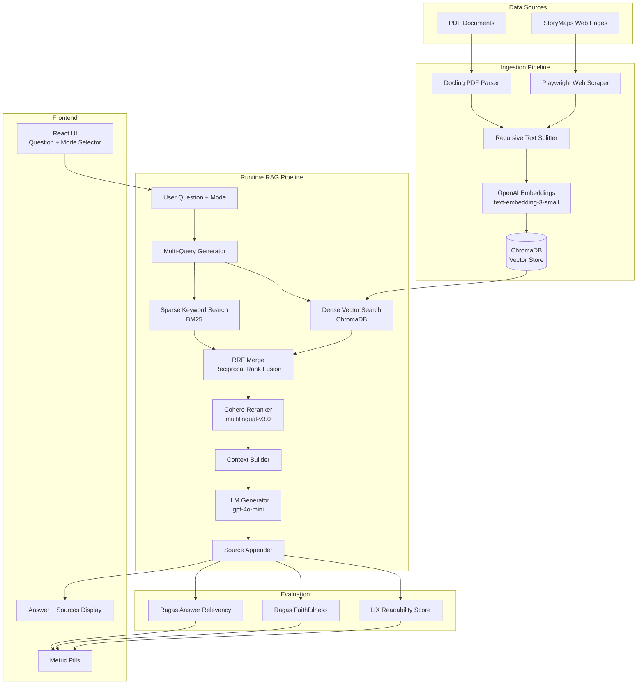
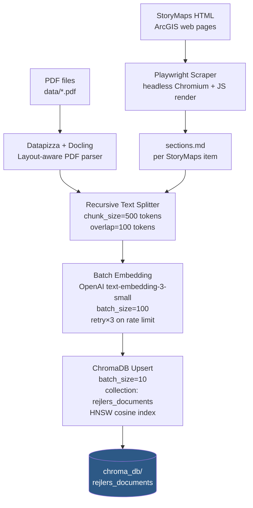
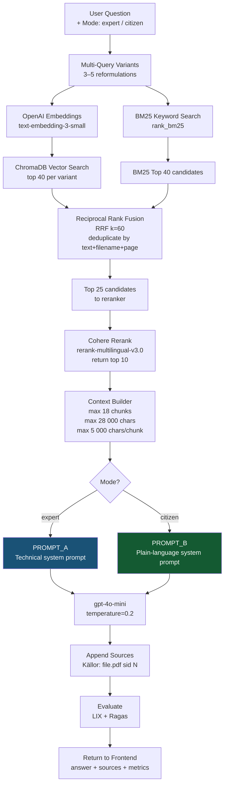
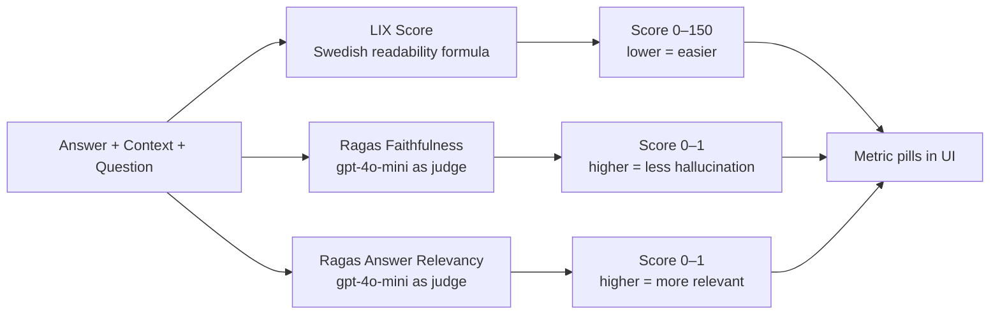

# Rejlers RAG – Pipeline Overview

## What This System Does

**Rejlers RAG** is a Retrieval-Augmented Generation (RAG) system built as a bachelor's thesis proof-of-concept for a Swedish railway infrastructure project (Bollebygd). It answers questions about the project by searching indexed source documents and generating grounded answers using an LLM. Answers are generated in two modes:

- **Expert mode** – technical, precise, professional language aimed at engineers and planners.
- **Citizen mode** – simplified, plain language aimed at the general public.

All answers cite their sources (filename + page number) and are evaluated automatically for quality.

---

## System Architecture (High-Level)



---

## Part 1: Ingestion Pipeline

The ingestion pipeline runs once (or on update) to index all source documents into the vector database.



### How it works step by step

1. **PDF Parsing** – PDFs are parsed with [Docling](https://github.com/DS4SD/docling) via the `datapizza-ai-parsers-docling` wrapper. Docling does layout-aware extraction, meaning it understands tables, headings, and multi-column text instead of just dumping raw characters.

2. **Web Scraping** – ArcGIS StoryMaps pages are scraped with [Playwright](https://playwright.dev/) (headless Chromium), which handles JavaScript-rendered content. The scraper waits for the page to fully render, then extracts section text into `sections.md` files saved under `data/sweco_storymaps_*_item_*/`.

3. **Text Splitting** – Both sources pass through a `RecursiveCharacterTextSplitter` (LangChain-style). Chunk size is 500 tokens (measured with `tiktoken`), overlap 100 tokens. Separators: double newline → newline → period → space. This preserves semantic units while keeping chunks small enough for tight retrieval.

4. **Embedding** – Each chunk is embedded using OpenAI's `text-embedding-3-small` model. Calls are batched (100 at a time) with exponential-backoff retry on 429 (rate limit) errors.

5. **Storage** – Embeddings + text + metadata (filename, page number, source type) are upserted into a ChromaDB collection called `rejlers_documents`. ChromaDB uses an HNSW index with cosine distance for fast approximate nearest-neighbour search. Metadata is capped at 300 chars per field to prevent SQLite bloat (ChromaDB stores metadata in SQLite).

---

## Part 2: Runtime RAG Pipeline

Every user question triggers this full pipeline.



### How it works step by step

#### 1. Multi-Query Generation (`_retrieval_query_variants`)
A single user question is expanded into 3–5 search variants:
- The original question as-is.
- The question stripped of Swedish question words (`vad`, `hur`, `varför`, `när`, `vilken`, `vilka`).
- A keyword bundle extracted from the question.
- Domain-specific railway terms if the question relates to routing: `bank`, `stråk`, `linjeföring`, `bro`, `tunnel`.
- Property-impact terms if relevant: `fastighet`, `markåtkomst`, `buller`, `vibration`.

This improves recall by covering different phrasings of the same intent.

#### 2. Hybrid Retrieval
Two independent retrieval methods run in parallel:

- **Dense / semantic search** – Each query variant is embedded and the top-40 most similar chunks are fetched from ChromaDB using cosine similarity on HNSW vectors. Captures *meaning*, even when exact words differ.
- **Sparse / keyword search (BM25)** – The same variants are run against a BM25Okapi index (built in-memory from all stored chunk texts). BM25 is a classic TF-IDF-style algorithm. Captures *exact technical terms*, abbreviations, and project codes that dense embeddings sometimes miss.

#### 3. Reciprocal Rank Fusion (RRF)
Results from all vector queries and BM25 are merged using RRF (k=60). RRF rewards chunks that rank highly in *multiple* lists without needing score normalization. Duplicates (same text head + filename + page) are removed, giving a single ranked candidate list.

#### 4. Cohere Reranking
The top-25 RRF candidates are sent to Cohere's `rerank-multilingual-v3.0` cross-encoder. Unlike the bi-encoder used for retrieval, a cross-encoder scores each (question, chunk) pair jointly, giving much more accurate relevance estimates. Returns the top-10 final chunks. The system degrades gracefully if no Cohere API key is set.

#### 5. Context Building
The top-10 chunks are assembled into a context block respecting three budgets:
- Max **18 chunks** total.
- Max **28 000 characters** total context.
- Max **5 000 characters** per individual chunk (long chunks are truncated with `…`).

This prevents token overflow in the LLM prompt while maximising the relevant information included.

#### 6. Prompt + LLM Generation
The context block is inserted into a prompt with one of two system prompts:

| Prompt | Target | Style |
|--------|--------|-------|
| **PROMPT_A (Expert)** | Engineers, planners | Technical, precise, professional; uses full Swedish infrastructure terminology |
| **PROMPT_B (Citizen)** | General public | Short sentences, low LIX target, avoids jargon, explains concepts simply |

Both prompts instruct the model to answer *only* from the provided context (no hallucination), always cite sources, and respond in Swedish. The LLM used is `gpt-4o-mini` at `temperature=0.2` (near-deterministic).

#### 7. Source Appending
The retrieved chunk metadata (filename + page number) is formatted as a Swedish citation line: `Källor: samrådshandling.pdf (sid 12), MKB-rapport.pdf (sid 7)` and appended to the answer.

---

## Part 3: Quality Evaluation

Every generated answer is evaluated on three metrics.



### LIX (Läsbarhetsindex)
Swedish readability formula: `(words / sentences) + (long_words × 100 / words)` where a "long word" is more than 6 letters. Score interpretation:
- < 30 → very easy (children's books)
- 30–40 → easy (popular press)
- 40–50 → average (newspapers)
- 50–60 → difficult (official documents)
- > 60 → very difficult (technical/legal)

Citizen mode targets LIX ≈ 30–40. Expert mode is typically 50+.

### Ragas Faithfulness
Measures whether every claim in the answer can be traced back to the retrieved context chunks. Uses `gpt-4o-mini` as judge. Score 0–1; 1.0 = fully grounded, 0 = fully hallucinated.

### Ragas Answer Relevancy
Measures whether the answer actually addresses the question. Score 0–1. Both Ragas metrics have their inputs truncated to fit token budgets before calling the judge LLM.

---

## Technology Stack

| Component | Technology | Why |
|-----------|-----------|-----|
| **PDF parsing** | Docling (via datapizza-ai-parsers-docling) | Layout-aware; handles Swedish planning documents with tables and multi-column text |
| **Web scraping** | Playwright (headless Chromium) | ArcGIS StoryMaps pages are JS-rendered; Playwright waits for the full render |
| **Text splitting** | tiktoken + recursive splitter | Token-accurate chunking; overlap preserves context across chunk boundaries |
| **Embeddings** | OpenAI `text-embedding-3-small` | Strong multilingual (Swedish) performance, low cost, 1536-dim |
| **Vector database** | ChromaDB (HNSW, cosine) | Embedded, no separate server needed, persistent on disk |
| **Keyword search** | BM25Okapi (rank_bm25) | Complements dense search for exact technical terms |
| **Rank fusion** | RRF (custom implementation) | Score-free merging of heterogeneous ranked lists |
| **Reranking** | Cohere `rerank-multilingual-v3.0` | Cross-encoder with first-class Swedish support |
| **LLM** | OpenAI `gpt-4o-mini` | Fast, cost-effective, strong instruction-following for structured prompts |
| **Readability** | LIX formula | Standard Swedish readability metric used in public communication research |
| **RAG evaluation** | Ragas 0.1+ | Framework-standard faithfulness + relevancy metrics |
| **API** | FastAPI + Uvicorn | Async Python REST API; thin layer over the pipeline |
| **Frontend** | React 19 + Vite 8 | Component-based UI; calls `/api/ask`, renders answer + metric pills |
| **Production serving** | Nginx (static) + Uvicorn (API) | Nginx proxies `/api/*` to the Python backend |
| **Deployment** | Railway (cloud) | Persistent volume for ChromaDB, env vars for secrets |
| **Containerisation** | Docker (multi-stage) | Reproducible builds; CPU-only PyTorch for smaller image |

---

## Data Model

Each document chunk stored in ChromaDB has:

```
id:        "<filename>_chunk_<N>"
embedding: [float × 1536]        # text-embedding-3-small output
document:  "<chunk text>"        # up to 500 tokens
metadata:
  filename:    "samrådshandling.pdf"
  page:        12
  source_type: "pdf" | "storymaps"
```

---

## API Contract

```
POST /api/ask
{
  "question": "Hur påverkas fastigheter längs linjen?",
  "mode": "citizen"          # or "expert"
}

→ 200 OK
{
  "answer":  "Fastigheter längs korridoren påverkas av…\n\nKällor: …",
  "sources": "Källor: samrådshandling.pdf (sid 12), MKB-rapport.pdf (sid 7)",
  "metrics": {
    "lix":              35.2,
    "faithfulness":     0.85,
    "answer_relevancy": 0.92
  }
}
```

---

## End-to-End Example

| Step | What happens |
|------|-------------|
| 1 | User types "Hur påverkas fastigheter längs linjen?" and picks **Citizen** mode |
| 2 | Frontend `POST /api/ask {question, mode: "citizen"}` |
| 3 | `run_rag()` generates 5 query variants |
| 4 | Vector search fetches ~200 candidate chunks across all variants |
| 5 | BM25 fetches 40 keyword-hit chunks |
| 6 | RRF merges all candidates → 25 deduplicated |
| 7 | Cohere reranks → top 10 |
| 8 | Context block assembled (~24 000 chars) |
| 9 | `gpt-4o-mini` generates simplified Swedish answer (PROMPT_B) |
| 10 | Sources appended: "Källor: samrådshandling.pdf (sid 12), …" |
| 11 | LIX computed: 35.2 (moderately easy – target hit) |
| 12 | Ragas faithfulness: 0.85, relevancy: 0.92 |
| 13 | Frontend renders answer + source list + three metric pills |
